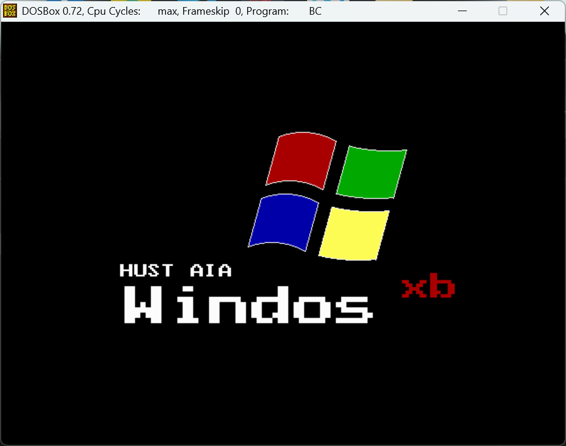

# winlike-file-system-

# 项目介绍

华中科技大学 人工智能与自动化学院 2025 年 C 语言课程设计 仿 windows 资源管理器

这是一个基于 DOS 的仿 win 的文件管理器

# 运行方法

## 方法一

- 双击 `Borland C++ 3.1.vbs`
- 点击上方 `RUN` （环境已经配置好了）

## 方法二

- 如果你的 vscode 已经安装了`Borland C`插件，可以在 vscode 中打开`DISK_C`后直接`Ctrl+Shift+P` `启动 Borland C`
- 点击上方 `RUN`

# 关于鼠标库和汉字库

## 鼠标库

- 我们为鼠标库做了完整点击过程的检测，即鼠标从按下到释放视为一次点击，更加符合实际
- 鼠标库内置的双击检测没有完成，希望能得到优化

## 汉字库

我们为这一版汉字库添加了 12 号字体

# 在WindowsXP上部署

- 直接将`PROJECT`文件夹放在C盘下
- 双击BC（注意上机要求用的BC与windows10/11上的不一样，不是dosbox哦）
- `File`->`Change dir...`->更改工作路径为`C:\PROJECT\DEVEL`
- `Project`->`Open project`->由于上面更改过工作路径了，这里直接可以看到`WIN_PRO.PRJ`，直接打开
- `Run`->`Run`，上面的.PRJ文件里面已经将路径配置号好了，所以不需要手动配置了

# 注意事项
- 密码为`123456`
- 在游玩过程中**不要删除** `PROJECT` `PROJECT/build` `PROJECT/devel` `PROJECT/src`
- 为了方便统计有效代码，我们将给鼠标库做的扩展新建了一个文件`mcontrb.cpp`及其头文件`mscontrb.h`
- `hz.cpp`和`load.cpp`中采用了绝对路径，最好不要改动文件夹结构
- 预选中高亮是独立于按钮的，按钮的绘制和点击判定是独立的，所以在更改按钮位置后记得更改点击判定区域和预选中高亮

# 作者的话

- 这是我和队友[lxb330](https://github.com/lxb330)自己做的第一个完整的项目，学会了许多，也成长了不少。。。收获颇丰！
- 祝好运！
